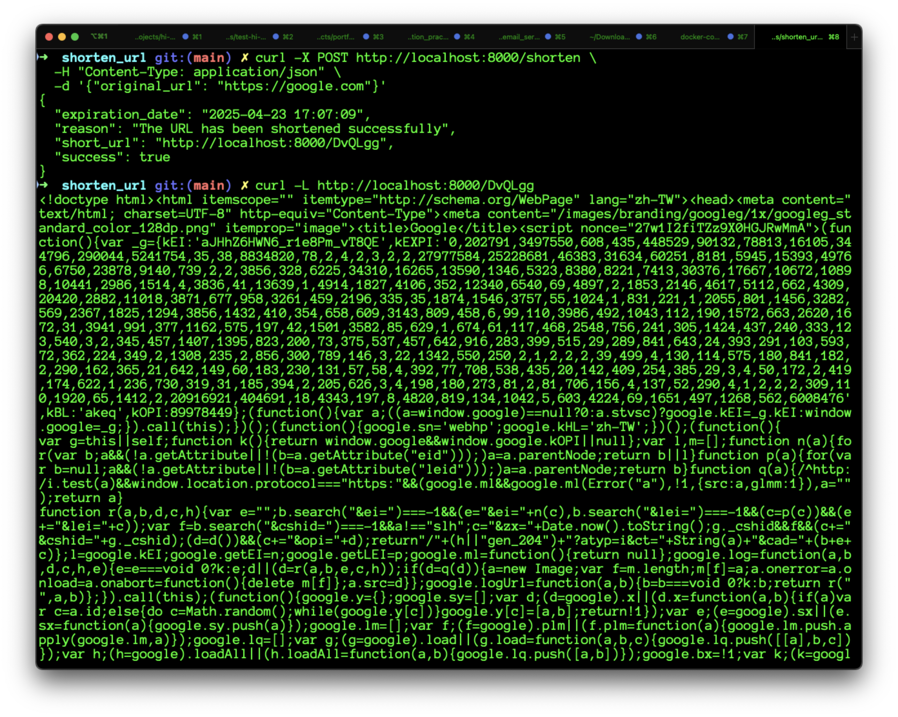

# URL Shortener Service

This project sets up a simple URL shortener service using Docker and Docker Compose.

## Prerequisites

Ensure that Docker and Docker Compose are installed on your machine. If not, follow these instructions:

### 1. **Install Docker**

- **macOS:** Follow the official guide: [Install Docker on macOS](https://docs.docker.com/docker-for-mac/install/)
- **Windows:** Follow the official guide: [Install Docker on Windows](https://docs.docker.com/docker-for-windows/install/)
- **Linux:** Follow the official guide: [Install Docker on Linux](https://docs.docker.com/engine/install/)

### 2. **Install Docker Compose**

Docker Compose should be installed alongside Docker. If it's not, follow the official guide: [Install Docker Compose](https://docs.docker.com/compose/install/).

To verify Docker and Docker Compose are installed, run:

```bash
docker --version
docker-compose --version
```

Both commands should output the installed versions.

⸻

### 3. **Setup Instructions**

- Clone the Repository

If you haven’t already, clone the repository that contains the docker-compose.yml file:

```
git clone https://github.com/chungchihhan/shorten_url.git
cd shorten_url
```

- Check `docker-compose.yml` File

Ensure that the project directory contains a docker-compose.yml file. The file should look like this:

```yaml
version: "3.8"

services:
  url-shortener:
    build: .
    image: cch1006/url-shortener:latest
    ports:
      - "8000:8000"
    volumes:
      - url_data:/data
    restart: always

volumes:
  url_data:
    driver: local
```

### 4. **Start the Service**

Run the following command to pull the image and start the service in detached mode:

```bash
docker-compose up -d
```

This will:

- Pull the image from Docker Hub (if it’s not already on your machine).
- Start the container running in the background.

⸻

### 5. **Testing the Service**

After the container is up and running, you can test the URL shortener service using curl.

#### 1️⃣ Shorten a URL

Run the following curl command to shorten a URL:

```bash
curl -X POST http://localhost:8000/shorten \
 -H "Content-Type: application/json" \
 -d '{"original_url": "https://google.com"}'
```

This will send a POST request to the /shorten endpoint with a JSON payload containing the URL to shorten.

#### 2️⃣ Access the Shortened URL

After successfully shortening a URL, you should receive a short URL in the response, such as http://localhost:8000/DvQLgg.

To test if the shortened URL works, run:

```bash
curl -L http://localhost:8000/DvQLgg
```

This will redirect to the original URL, such as https://google.com



### 6. **Stopping the Service**

To stop the service, run:

```bash
docker-compose down
```

This will stop and remove the containers and networks associated with the service. However, the `url_data` volume will persist, ensuring that any shortened URLs remain intact.

When you run `docker-compose up` again, you can still access previously shortened URLs, such as:

```bash
curl -L http://localhost:8000/DvQLgg
```
